# A Pizza Perfection

A Pizza Perfection is a website which gives the user information on the history of two main types of pizza, these being Neopolitan and Romana. The website will explain the differences between the two allowing the user to choose which they prefer and try them at home.

There will be a section for users to provide feedback and topping inspirational ideas.

[Live Webpage](https://sliceshare.herokuapp.com/)

1. [Project Goals](#project-goals)
    1. [User Goals](#user-goals)
    2. [Site Owner Goals](#site-owner-goals)
2. [User Experience](#user-experience)
    1. [Target Audience](#target-audience)
    2. [User Requirements and Expectations](#user-requirements-and-expectations)
    3. [User Stories](#user-stories)
3. [Style Choices](#style-choices)
    1. [Design](#design)
    2. [Colour](#colour-scheme)
    4. [Structure](#structure)
    5. [Initial Framework](#initial-framework)
4. [Technologies Used](#technologies-used)
    1. [Languages](#languages)
    2. [Frameworks & Tools](#frameworks-and-tools)
5. [Features](#features)
6. [Testing](#testing)
    1. [Manual Testing](#manual-testing)
    5. [Device testing](#perform-test-on-devices)
    6. [Browser compatibility](#browser-compatability)
    7. [Testing user stories](#testing-user-stories)
7. [Validation](#validator-testing)
    1. [HTML](#html)
    2. [CSS](#css)
    3. [Lighthouse](#lighthouse-score)
    4. [Accessibility](#accessibility)
8. [Bugs Fixed](#bugs-fixed)
9. [Deployment](#deployment)
10. [Credits](#credits)
    2. [Content](#content)
 

## Project Goals

### User Goals

### Site Owner Goals

## Style Choices

### Design

### Colour Scheme

For the colour of the Home page I used [Coolors](https://coolors.co/) which allowed me to utilise the colour of the cheese/dough for a palette.

Colour Palette

 

### Structure

### Initial Framework

Before starting the website I used a framework design tool called [Balsamic](https://balsamiq.com/) to mockup an initial design idea.

Index

 

## Technologies Used

### Languages
   - Python
   - JavaScript
   - HTML5
   - CSS3

### Frameworks, Libraries, Programs
- Python Built-in Modules:
  - [os](https://docs.python.org/3/library/os.html) 

- External Packages
  - [cloudinary](https://pypi.org/project/cloudinary/1.29.0/) 
  - [crispy-bootstrap5](https://pypi.org/project/crispy-bootstrap5/0.6/) 
  - [dj-database-url](https://pypi.org/project/dj-database-url/0.5.0/) 
  - [dj3-cloudinary-storage](https://pypi.org/project/dj3-cloudinary-storage/0.0.6/) 
  - [Django](https://pypi.org/project/Django/3.2.14/) 
  - [django-allauth](https://pypi.org/project/django-allauth/0.51.0/)
  - [django-crispy-forms](https://pypi.org/project/django-crispy-forms/1.14.0/) 
  - [gunicorn](https://pypi.org/project/gunicorn/20.1.0/)
  - [psycopg2](https://pypi.org/project/psycopg2/2.9.3/) 

### Programs & Tools

- [Google Fonts:](https://fonts.google.com/)
  - Was used to to incorporate font styles.  
- [Bootstrap](https://getbootstrap.com/)
  - Was used to create the front-end design.
- [GitPod:](https://gitpod.io/)
  - Gitpod was used as IDE to commit and push the project to GitHub.
- [GitHub:](https://github.com/)
  - Was used for all storing and backup of the code pertaining to the project.
- [Cloudinary:](https://cloudinary.com/home-101222)
  - Used to store all images relating to the blog
- [Heroku](https://www.heroku.com/home)
  - Used to host the database and app

## Features
### Existing Features

- __Navigation Bar__

  - Featured on all pages, the full responsive navigation bar 
  - This section will allow the user to easily navigate from page to page across all devices without having to revert back to the previous page via the ‘back’ button. 

  

- __Homepage__

  - The landing page for the blog hosts cards representing each different blog post. 
  - An image accompanies an excerpt from the post to entice users to open a post

  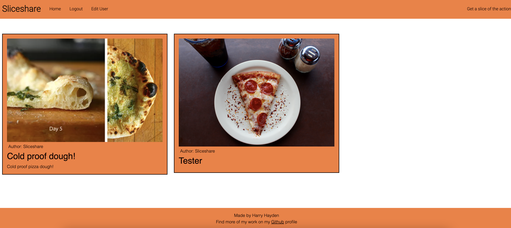

- __Post Detail__

  - An individual page for each post. Allowing the user to expand the card from the homepage
  - A detailed blog view is provided

  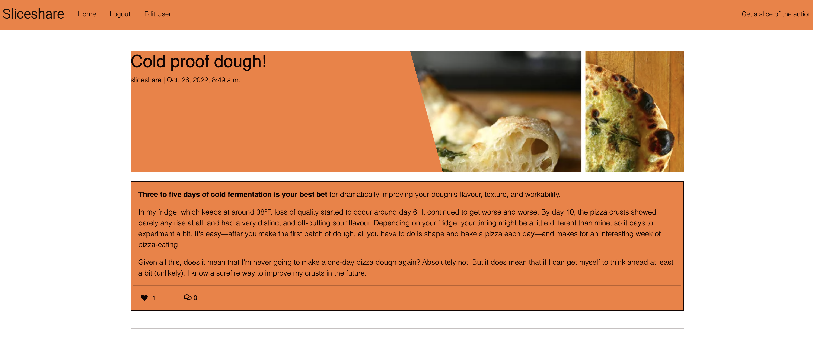

- __Likes__

  - Each post can accumulate likes from other blog users
  - Allows interaction for the user

  

- __Comments__

  - Each post can be commented on by other users so that a community feel can be achieved
  - Allows interaction for the user and discussions to occur

  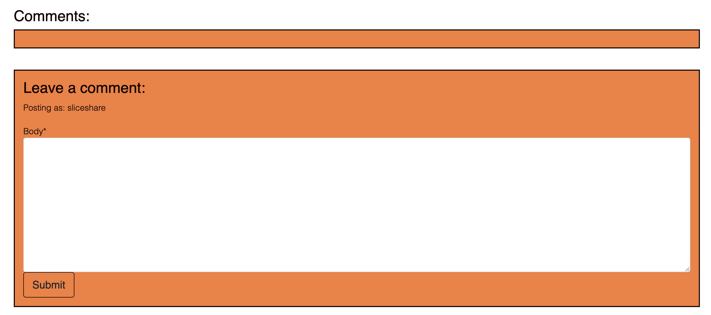

- __Edit User__

  - Allowing users to edit their username and personal details

  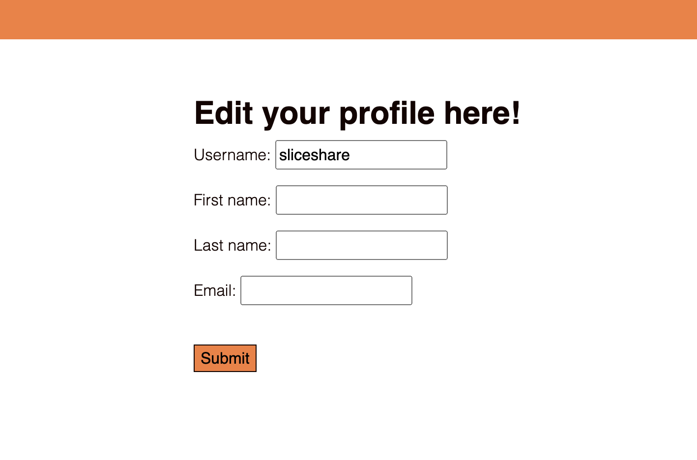

- __Register User__

  - Allowing users to register with a username and personal details
  - Allows the user to become part of the community with priveleges to comment and like posts

  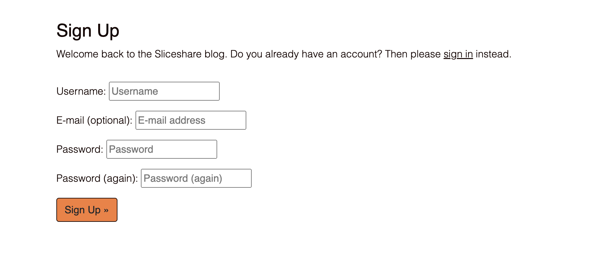

### Features Left to Implement

- Post Creation 
- Users add their own images to profile and about sections without admin support

## Testing 

* ## Manual Testing
    * I planned and carried out the below manual tests for the pages.

   * ### Manual Tests Conducted
      * Navigation Menu
        * Ensure that when the header is clicked it returns to the home page
        * Ensure that all navigation links correctly navigate to their respective pages when clicked
        * Ensure that all the :hover psuedo selectors work when using the navigation bar
        * Ensure the responsiveness of the navigation bar
    * Home/Landing Section
        * Ensure the page loads correctly
        * Ensure that the cards are correctly spaced
        * Ensure that card images are correct
        * Ensure the responsiveness of the page
        * Ensure that the card links work
      * Register User
        * Ensure that the font-style and size are visible and of good contrast
        * Ensure that there are no spelling mistakes
        * Ensure that the form loads correctly
        * Ensure the responsiveness of the page
        * Ensure a user can be created
      * Edit User
        * Ensure that there are no spelling mistakes
        * Ensure that the form loads correctly
        * Ensure the responsiveness of the page
        * Ensure a user can be edited
      * Post Detail
        * Ensure that all required elements work
        * Ensure that the font-style and size are visible and of good contrast
        * Ensure that there are no spelling mistakes
        * Ensure when a verified user is logged in they are able to leave a comment
        * Ensure when a verified user is logged in they are able to like a post
        * Ensure the responsiveness of the page
      * Footer Section
        * Ensure that when you select Github link it opens in a new window
        * Ensure the responsiveness of the Footer

### Perform test on devices
The website was tested on the following devices:
- MacBook Pro 13"
- MacBook Pro 13" with 17" monitor
- Iphone 7
- Iphone 11 Mini

In addition, the website was tested using Google Chrome Developer Tools Device Toggeling option for all available device options.

### Browser compatability
The website was tested on the following browsers:
- Google Chrome
- Safari

## Validator Testing 

### HTML
Validation completed by [W3S](https://validator.w3.org/). This validator returned no errors for HTML.

  

Index Page
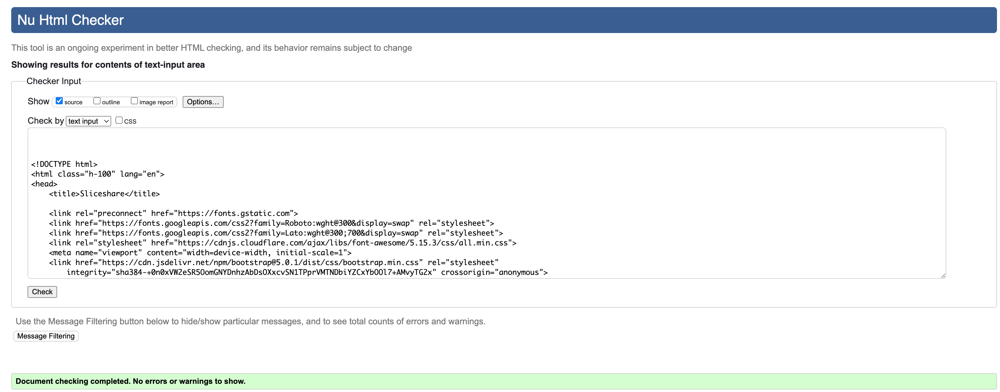

  

Post Detail
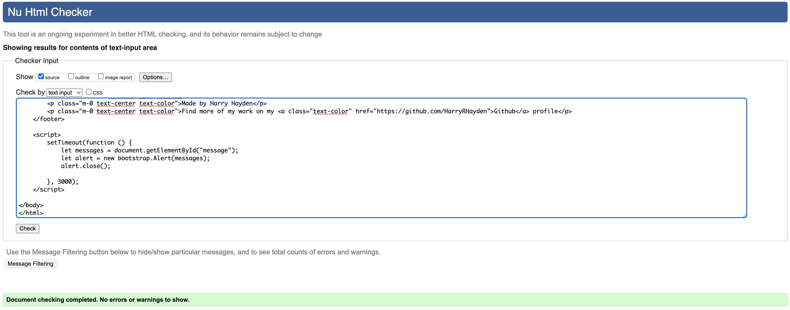

  

Edit User
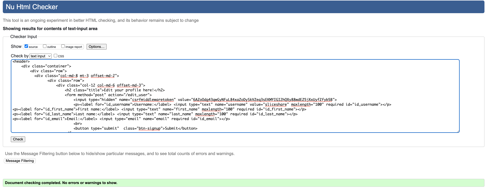

  

Logout
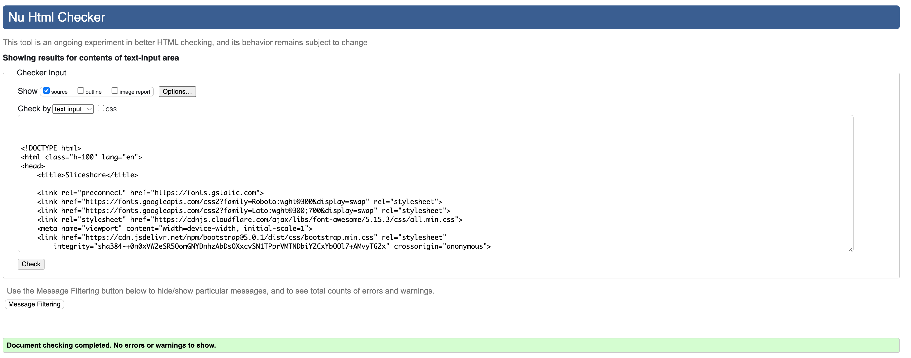

  

Register
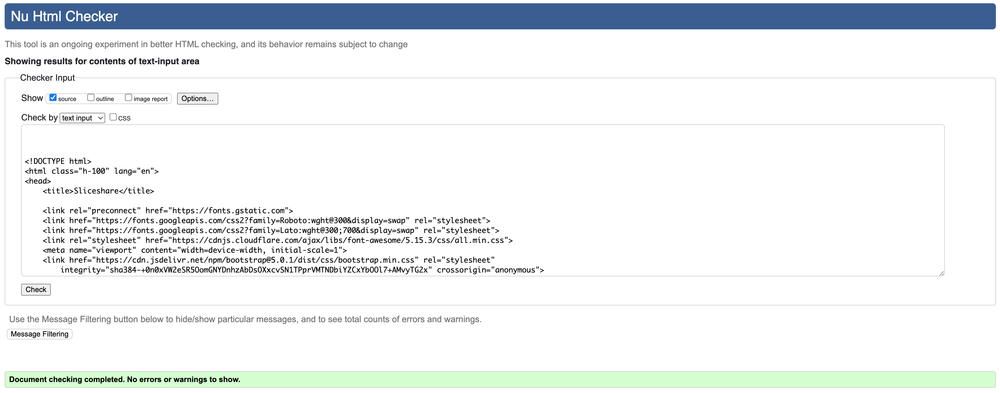

### CSS

Validation for CSS coding was completed by [W3S CSS Validator](https://jigsaw.w3.org/css-validator/) and returned no errors for my CSS coding.

  

CSS
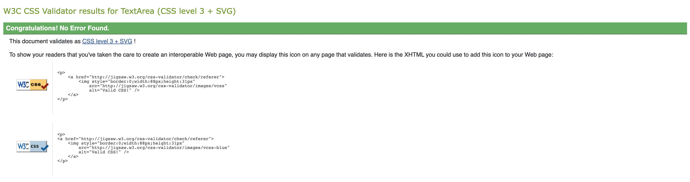

  
### Lighthouse Score

Lighthouse Index
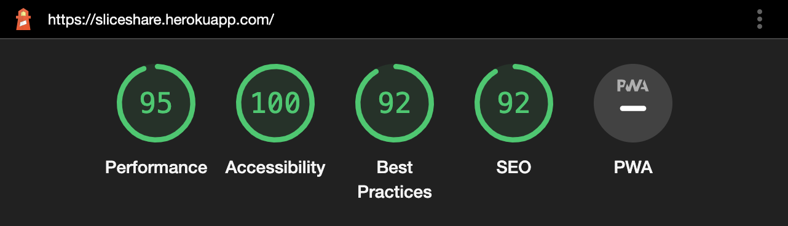

### Accessibility

Accessibility was tested using [Wave Webaim](https://wave.webaim.org/) and returned no errors.

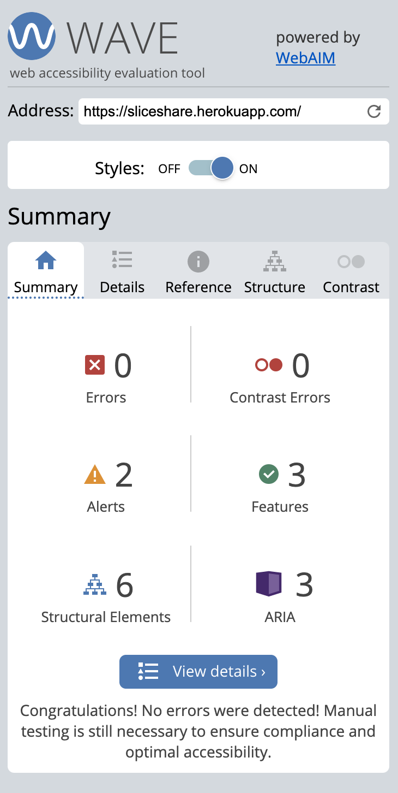

## Bugs Fixed

### 

### Testing user stories

1. 

| **Feature** | **Action** | **Expected Result** | **Actual Result** |
|-------------|------------|---------------------|-------------------|
|  |  |  |  |

  

User Story 1

 

  ## Deployment

### Deploying with Heroku

I followed the below steps using the Code Institute tutorial:

The following command in the Gitpod CLI will create the relevant files needed for Heroku to install your project dependencies `pip3 freeze --local > requirements.txt`. Please note this file should be added to a .gitignore file to prevent the file from being committed.

1. Go to [Heroku.com](https://dashboard.heroku.com/apps) and log in; if you do not already have an account then you will need to create one.
2. Click the `New` dropdown and select `Create New App`.
3. Enter a name for your new project, all Heroku apps need to have a unique name, you will be prompted if you need to change it.
4. Select the region you are working in.

#### Heroku Settings  
You will need to set your Environment Variables - this is a key step to ensuring your application is deployed properly.
1. In the Settings tab, click on `Reveal Config Vars` and set the following variables:
    - Add key: DATABASE_URL, this should have been created automatically by Heroku.
    - Add key: CLOUDINARY_URL and the value as your cloudinary API Environment variable e.g.
    - Add key: SECRET_KEY and the value as a complex string which will be used to provide cryptographic signing.

####  Heroku Deployment  
In the Deploy tab:
1. Connect your Heroku account to your Github Repository following these steps:
    - Click on the `Deploy` tab and choose `Github-Connect to Github`.
    - Enter the GitHub repository name and click on `Search`.
    - Choose the correct repository for your application and click on `Connect`.
2. You can then choose to deploy the project manually or automatically, automatic deployment will generate a new application every time you push a change to Github, whereas manual deployment requires you to push the `Deploy Branch` button whenever you want a change made.
3. Once you have chosen your deployment method and have clicked `Deploy Branch` your application will be built and you should now see the `View` button, click this to open your application.

You can fork the repository by following these steps:
1. Go to the GitHub repository
2. Click on Fork button in upper right hand corner

You can clone the repository by following these steps:
1. Go to the GitHub repository 
2. Locate the Code button above the list of files and click it 
3. Select if you prefer to clone using HTTPS, SSH, or Github CLI and click the copy button to copy the URL to your clipboard
4. Open Git Bash
5. Change the current working directory to the one where you want the cloned directory
6. Type git clone and paste the URL from the clipboard ($ git clone https://github.com/YOUR-USERNAME/YOUR-REPOSITORY)
7. Press the Enter key to create your local clone.

The live link can be found here - https://sliceshare.herokuapp.com/

## Credits 
- Matt Rudge for the CodeStar blog videos. Would also like to thank the Slack Community for their help on this project as well.

### Content 
- Default image for posts was from [Pexels](https://www.pexels.com/search/pizza/)